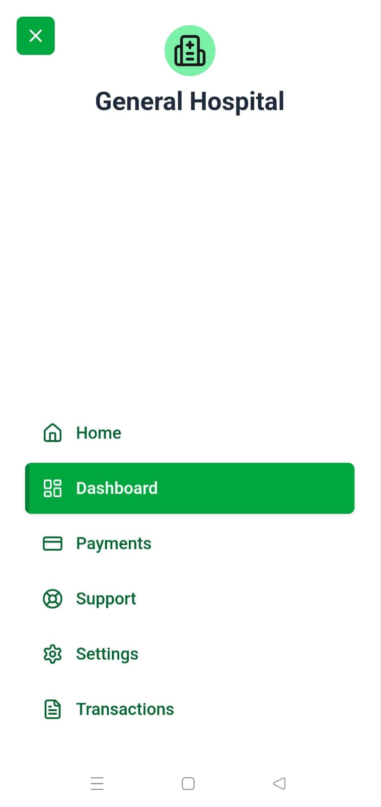
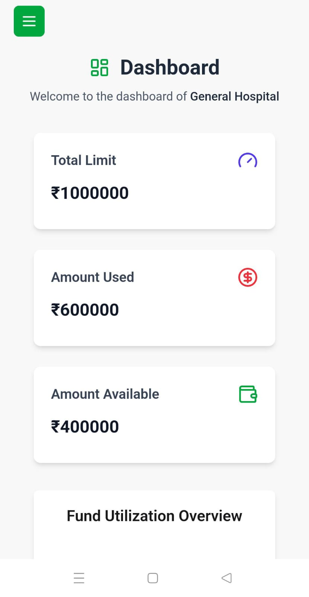
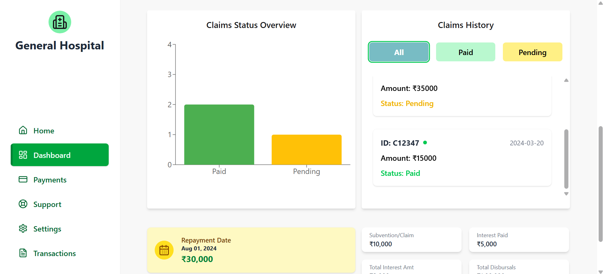
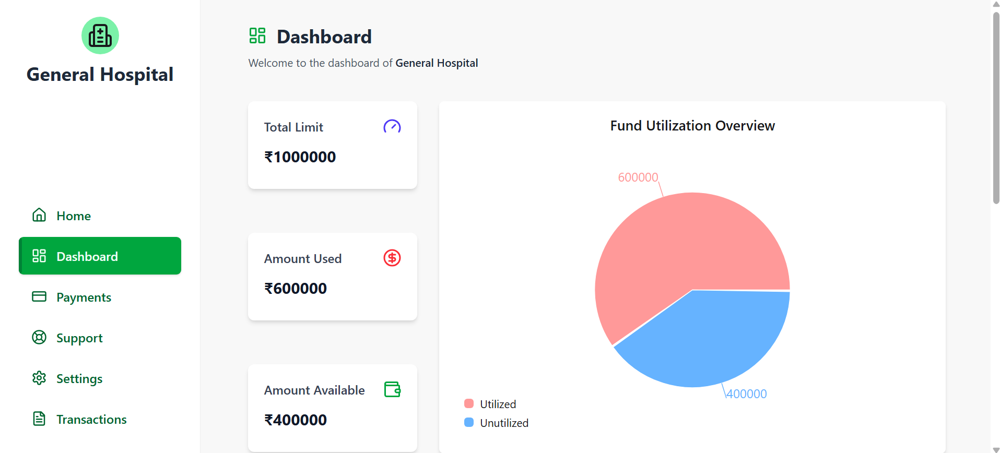

# HealthCRED Hospital Dashboard

A responsive, modern dashboard built using **React + Vite + Tailwind CSS + TypeScript**, this project fetches real-time hospital data via a REST API and visualizes it through interactive charts and graphs. It is optimized for performance, reusability, and clarity, while also integrating a global context for API state management.

🔗 **Live Demo**: [https://your-dashboard-url.vercel.app](https://your-dashboard-url.vercel.app)

---

## Features

- Interactive graph displaying key metrics
- Real-time data fetch from provided API
- Global state management using React Context
- Component-based architecture for reusability
- Custom loading indicators during async operations
- Fully responsive layout using Tailwind CSS
- Type-safe code using TypeScript interfaces
- Hosted live via Vercel for public access

---

## Tech Stack

- **React + Vite** – Fast development environment
- **Tailwind CSS** – Utility-first CSS for rapid UI building
- **TypeScript** – Type-safe coding for reliability
- **Recharts** – Data visualization via responsive graphs
- **React Context API** – For managing global app state
- **Axios** – Simplified API handling

---

## SetUp

### Installation

1. Clone this repository:

   ```bash
   git clone https://github.com/anshu-kumar27/Hospital_Dashboard
   ```

2. Install dependencies And Run:

   ```bash
   cd ./Hospital_Dashboard
   npm install
   npm run dev
   ```

---

## 🧾 API Integration

The dashboard consumes **GET** API endpoint for the data

## File Structure

```
├── src
│   ├── components
│   │   ├── reusable/               # Reusable UI components used across multiple pages
│   │   └── Graphs/                 # All graph-related components and chart utilities
│   │
│   ├── pages/                      # All main route components (Dashboard, Redirection, etc.)
│   │
│   ├── context/
│   │   └── HospitalContext.tsx     # Global context for managing hospital data and avoiding prop drilling
│   │
│   ├── services/
│   │   └── HospitalData.tsx        # Handles API call and updates HospitalContext accordingly
│   │
│   ├── types/
│   │   └── index.ts                # Centralized definition of TypeScript types used across the app
│
├── package.json                    # Project dependencies and scripts
└── README.md                       # Project overview and developer documentation
```

---

### Design Choices & Performance Optimizations

## API Handling & Loading UX

A full-page loader (MainLoader) is displayed while essential API data is being fetched, ensuring that users interact only after the app is ready. This prevents flickering or partial renders.

## Reusability & Maintainability

Built generic and reusable UI components to eliminate repetition and speed up future development. All logic and components are modularized and organized into dedicated folders, improving readability and ease of collaboration.

## File Structure & Scalability

The project is structured with clear separation between pages, components, services, and context logic — laying the groundwork for scalable development as the app grows.

---

## 🖼️ Screenshots

### 📱 Phone View

<table>
  <tr>
    <td></td>
    <td></td>
  </tr>
  <tr>
    <td></td>
    <td></td>
  </tr>
</table>

---

### 💻 Laptop View

<table>
  <tr>
    <td></td>
    <td></td>
  </tr>
</table>
>
